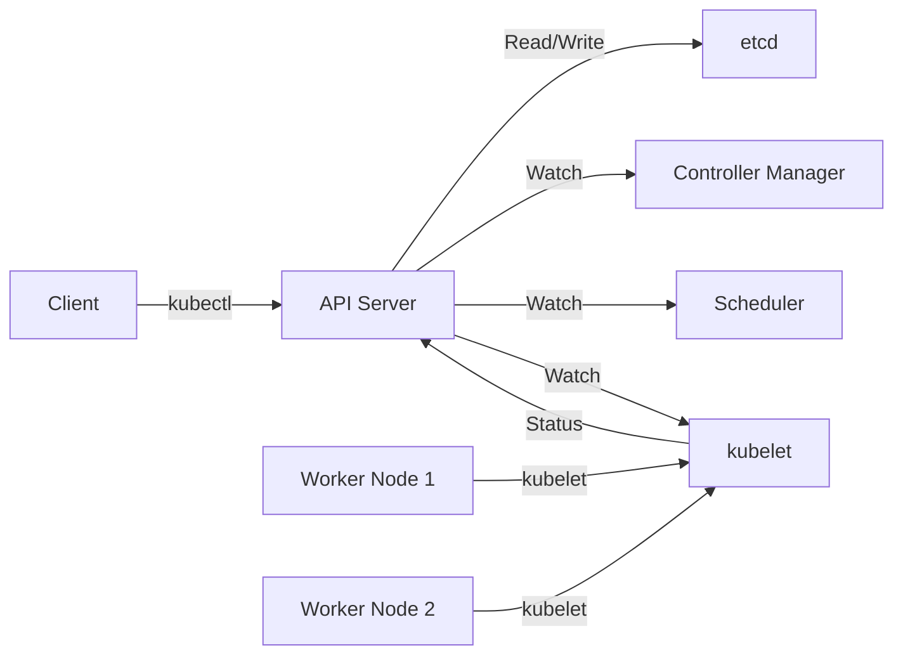

# 3.5 Understanding Kubernetes Architecture

## Kubernetes Cluster Components

### 1. Control Plane (Master Node)

#### Key Components:
- **API Server**
  - Frontend for the Kubernetes control plane
  - Processes REST operations
  - Validates and configures data for API objects

- **etcd**
  - Consistent and highly-available key-value store
  - Stores all cluster data
  - Backs up cluster state and configuration

- **Controller Manager**
  - Runs controller processes
  - Node controller
  - Replication controller
  - Endpoints controller
  - Service Account & Token controllers

- **Scheduler**
  - Watches for newly created Pods with no assigned node
  - Selects a node for the Pod to run on
  - Considers resource requirements, hardware constraints, etc.

### 2. Worker Nodes

#### Key Components:
- **kubelet**
  - Agent that runs on each node
  - Ensures containers are running in a Pod
  - Takes PodSpecs and ensures described containers are running

- **kube-proxy**
  - Network proxy
  - Maintains network rules
  - Implements Kubernetes Service concept

- **Container Runtime**
  - Software responsible for running containers
  - Examples: containerd, CRI-O, Docker Engine

## Node Communication

## High Availability (HA) Architecture

### Control Plane HA
- Multiple API servers
- Multiple etcd instances
- Multiple controller managers and schedulers
- Load balancer in front of API servers

### Worker Node HA
- Multiple worker nodes
- Pod distribution across nodes
- Node auto-repair and auto-scaling

## Networking Model

### Key Principles:
1. All containers can communicate with all other containers without NAT
2. All nodes can communicate with all containers without NAT
3. The IP that a container sees itself as is the same IP that others see it as

### Network Components:
- **Pods**: Get their own IP address
- **Services**: Stable IP addresses and DNS names
- **Ingress**: Manages external access to services
- **Network Policies**: Define how pods communicate with each other

## Storage Architecture

### Key Concepts:
- **Volumes**: Directory accessible to containers in a Pod
- **PersistentVolumes (PV)**: Cluster-wide storage resources
- **PersistentVolumeClaims (PVC)**: User's request for storage
- **StorageClass**: Defines storage "classes" with different QoS levels

## Security Architecture

### Key Components:
- **Authentication**: Verifies user identity
- **Authorization**: Determines what a user can do
- **Admission Control**: Validates and modifies requests
- **Network Policies**: Controls pod-to-pod communication
- **Secrets**: Manages sensitive information

## Scaling Architecture

### Horizontal Pod Autoscaler (HPA)
- Automatically scales the number of pods
- Based on CPU utilization or custom metrics

### Cluster Autoscaler
- Automatically adjusts the size of the cluster
- Adds/removes nodes based on resource requirements

## Monitoring and Logging

### Key Components:
- **Metrics Server**: Cluster-wide aggregator of resource usage data
- **cAdvisor**: Container resource usage and performance metrics
- **Logging**: Container and system logs
- **Monitoring**: Prometheus, Grafana, etc.

## Best Practices

1. **Control Plane**
   - Run multiple control plane nodes for HA
   - Use dedicated nodes for control plane components
   - Regularly back up etcd

2. **Worker Nodes**
   - Use node pools for different workloads
   - Implement proper resource requests and limits
   - Use taints and tolerations for specialized nodes

3. **Networking**
   - Use Network Policies for security
   - Implement proper ingress controllers
   - Consider service meshes for complex deployments

4. **Storage**
   - Use StorageClasses for dynamic provisioning
   - Implement proper backup strategies
   - Consider CSI drivers for advanced storage features
